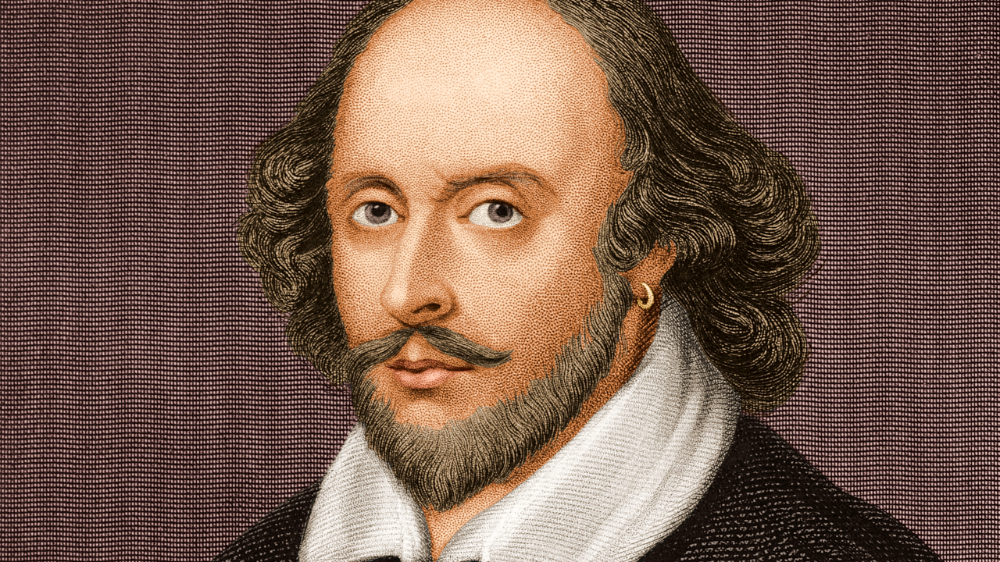

### William Shakespeare — *Hamlet*, Act III, Scene II (*The Murder of Gonzago*)

  
  

    In this passage from the <em>play within the play</em>, the Player King reflects on the fragility of human intention. 
    He suggests that our purposes, though born with passion, often fade with time — like unripe fruit that eventually falls on its own. 
    The speech captures the tension between <strong>will and fate</strong>, a central theme in <em>Hamlet</em>.
  

 

| Original (English) | Translation (Portuguese) |
|--------------------|-----------------------|
| **Purpose is but the slave to memory,** | **Intenções são escravas da memória;** |
| Of violent birth, but poor validity; | São fortes, mas têm vida transitória; |
| Which now, like fruit unripe, sticks on the tree, | Qual fruto verde que se ostenta, duro, |
| But fall, unshaken, when they mellow be. | E há de cair quando ficar maduro. |
| Most necessary ’tis that we forget | É fatal que esqueçamos de nos dar |
| To pay ourselves what to ourselves is debt: | O que a nós mesmos temos de pagar: |
| What to ourselves in passion we propose, | Aquilo que juramos na paixão, |
| The passion ending, doth the purpose lose. | Finda a mesma, perdeu a ocasião. |
| The violence of either grief or joy | A violência das dores e alegrias |
| Their own enactures with themselves destroy: | Destrói as suas próprias energias. |
| Where joy most revels, grief doth most lament; | Onde há prazer, a dor põe seu lamento; |
| Grief joys, joy grieves, on slender accident. | Se a mágoa ri, chora o contentamento. |
| This world is not for aye, nor ’tis not strange | O mundo não é firme, e é bem frequente |
| That even our loves should with our fortunes change; | O próprio amor mudar constantemente; |
| For ’tis a question left us yet to prove, | E ainda está para ficar provado |
| Whether love lead fortune, or else fortune love. | Se o fado guia o amor, ou este o fado. |
| The great man down, you mark his favourite flies; | Se o grande cai, não mais possui amigos, |
| The poor advanced makes friends of enemies. | Sobe o pobre, e não tem mais inimigos. |
| And hitherto doth love on fortune tend; | E tanto o amor à morte se escraviza |
| For who not needs shall never lack a friend, | Que amigos tem quem deles não precisa; |
| And who in want a hollow friend doth try, | Quem na dor prova o amigo que é tratante |
| Directly seasons him his enemy. | Prepara um inimigo nesse instante. |
| But, orderly to end where I begun, | Mas, para terminar como o começo, |
| Our wills and fates do so contrary run | Cada fato é a idéia tão avesso, |
| That our devices still are overthrown | Que os planos ficam sempre insatisfeitos; |
| Our thoughts are ours, their ends none of our own. | As idéias são nossas, não os feitos. |

> — *William Shakespeare, Hamlet* [III.ii.]
